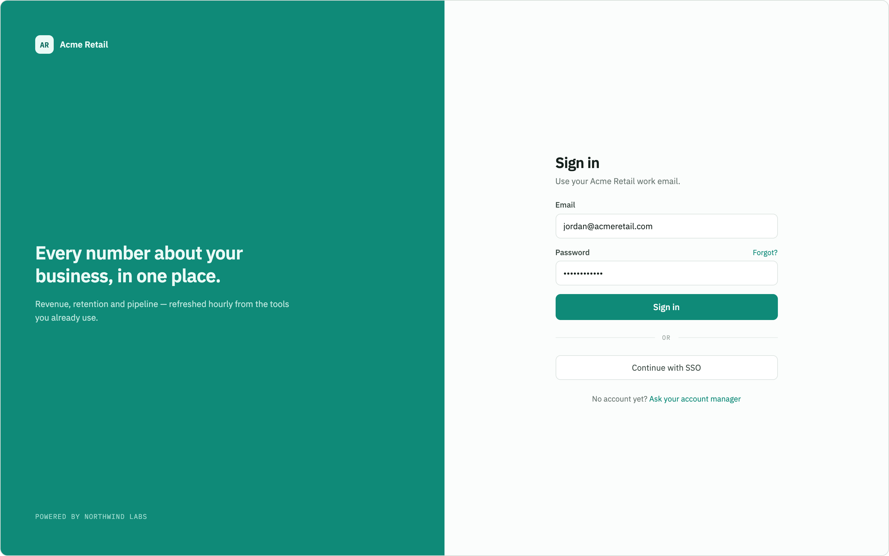
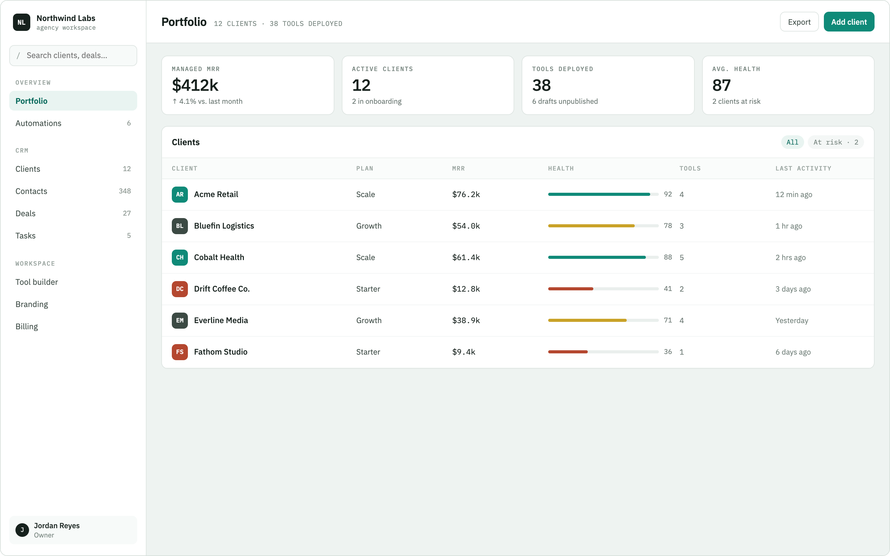
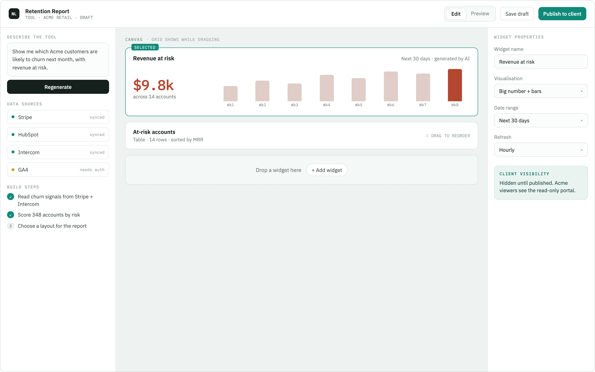
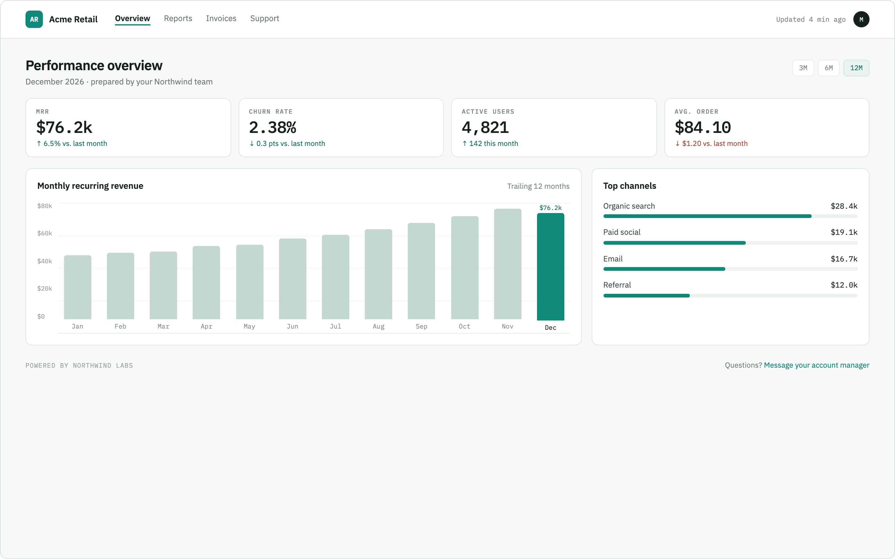
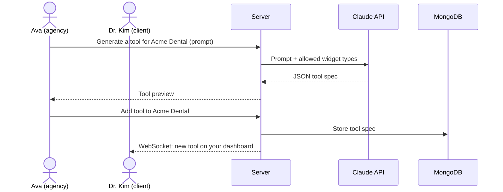

# ForgeCRM

[My Notes](notes.md)

ForgeCRM is a client dashboard platform for AI agencies. The agency manages its clients in one place and uses AI to build each client a custom dashboard, and each client logs in to see their own.

### Elevator pitch

Every B2B business runs on a similar basic dasboard setup behind the scenes. But every client also wants to see something a little different, and building custom dashboards by hand takes up hours of development. **ForgeCRM** would start as the CRM for my AI agency. I could track every client in one place, and the AI Tool Builder turns a sentence like *"show how many calls their AI receptionist handled this week"* into a working widget on a client's dashboard in a fraction of the time it would take to code it all by hand. Clients log in to their own branded portal to see results live and send us requests. Because every tool is built from the same flexible base, the long-term plan is to offer ForgeCRM to other agencies under their own brand, or directly to businesses that want to design their own dashboards.

### Design

Everyone uses the same login page. After logging in, agency team members are routed to the agency dashboard and clients are routed to their own portal.

The agency dashboard shows the agency's clients and a live feed of what the team and clients are doing.

In the AI Tool Builder, an agency team member picks a client, describes a tool, previews what the AI generated, and adds it to that client's dashboard.

The client portal is what the agency's client sees. It is their branded dashboard made of the tools the agency built for them, plus a way to send the agency requests.

Here is the sequence of what happens when the agency builds a new tool and the client sees it appear:

### Key features

- Secure registration, login, and logout with two kinds of users: agency team members and client users
- Agency team can add, edit, and remove clients, and track each client's plan, stage, and renewal date
- AI Tool Builder where the agency describes a tool in plain English and AI builds it as a widget (chart, stat card, table, or calculator) that can be previewed, refined, and saved
- Each client gets their own dashboard made of the tools the agency built for them
- Client portal with the client's name and branding, where they see their dashboard and send requests to the agency
- Clients can only see their own dashboard and data, never another client's
- Live updates: clients see new tools and data as soon as the agency adds them, and the agency sees client requests and activity as they happen

### Technologies

I am going to use the required technologies in the following ways.

- **HTML** - Correct semantic structure for the application (header, nav, main, section, footer). Pages for login, the agency dashboard, client management, the tool builder, and the client portal. The footer links to my GitHub repository.
- **CSS** - A clean, professional look that works on desktop and mobile using flexbox and grid for the widget layout. Consistent color scheme and whitespace with good contrast. The client portal uses each client's accent color so it feels like their own. Simple animations when a new widget is added or a new item appears in the activity feed.
- **React** - A single page application built with components for the login form, navigation bar, client list, tool builder, activity feed, request form, and each widget type. React Router sends agency users to the agency views and client users to their portal, and blocks each type of user from the other's pages. Widgets are rendered from saved JSON tool specs, so an AI-generated tool is just data that a generic `<Widget>` component knows how to draw. The display updates immediately when data changes.
- **Service** - A Node.js/Express backend with endpoints for:
  - Registering, logging in, and logging out users, with each user marked as an agency member or a client
  - Creating, reading, updating, and deleting clients (agency only)
  - Saving, listing, editing, and deleting tools on a client's dashboard (agency can edit, clients can only view their own)
  - Sending and viewing client requests
  - Generating a tool: the backend sends the description to the Anthropic Claude API and returns a JSON tool spec. The API is called from the backend so the key stays secret, and the AI can only choose from a fixed set of widget types and fields, so it never generates code that runs in the browser.
- **DB/Login** - MongoDB stores users, their role, and auth tokens, as well as clients, tool specs, dashboard data, requests, and activity history. Endpoints check the logged-in user's role and client before returning anything, so a client can only ever read their own data. I'm thinking of using supabase instead as well.
- **WebSocket** - When the agency adds or changes a tool or data on a client's dashboard, the server pushes the update to that client's open portal. When a client sends a request or views their dashboard, the server pushes it to the agency's live activity feed.

## 🚀 Specification Deliverable

For this deliverable I did the following. I checked the box `[x]` and added a description for things I completed.

- [x] I completed the prerequisites for this deliverable (Git commit requirement)
- [x] **Proper use of Markdown** - Used headings, links, images, bold and italic text, lists, code formatting, and a Mermaid diagram.
- [x] **A concise and compelling elevator pitch** - See the elevator pitch section above.
- [x] **Description of key features** - See the key features section above.
- [x] **Description of how you will use each technology including your 3rd party API and use of WebSocket** - See the technologies section above. The third-party API is the Anthropic Claude API, used for AI tool generation. WebSocket pushes new tools to clients and client activity to the agency in real time.
- [x] **One or more rough sketches of your application. Images must be embedded in this file using Markdown image references.** - Four sketches (login, agency dashboard, AI Tool Builder, and client portal) are embedded in the design section above.

## 🚀 AWS deliverable

For this deliverable I did the following. I checked the box `[x]` and added a description for things I completed.

- [ ] **Rented EC2 server** - I did not complete this part of the deliverable.
- [ ] **Leased domain name** - I did not complete this part of the deliverable.
- [ ] **Server accessible** from my domain: [https://yourdomainnamehere.click](https://yourdomainnamehere.click) - I did not complete this part of the deliverable.

## 🚀 HTML deliverable

For this deliverable I did the following. I checked the box `[x]` and added a description for things I completed.

- [ ] I completed the prerequisites for this deliverable (Simon deployed, GitHub link, Git commits)
- [ ] **HTML pages** - I did not complete this part of the deliverable.
- [ ] **Proper HTML element usage** - I did not complete this part of the deliverable.
- [ ] **Links** - I did not complete this part of the deliverable.
- [ ] **Text** - I did not complete this part of the deliverable.
- [ ] **3rd party API placeholder** - I did not complete this part of the deliverable.
- [ ] **Images** - I did not complete this part of the deliverable.
- [ ] **Login placeholder** - I did not complete this part of the deliverable.
- [ ] **DB data placeholder** - I did not complete this part of the deliverable.
- [ ] **WebSocket placeholder** - I did not complete this part of the deliverable.

## 🚀 CSS deliverable

For this deliverable I did the following. I checked the box `[x]` and added a description for things I completed.

- [ ] I completed the prerequisites for this deliverable (Simon deployed, GitHub link, Git commits)
- [ ] **Visually appealing colors and layout. No overflowing elements.** - I did not complete this part of the deliverable.
- [ ] **Use of a CSS framework** - I did not complete this part of the deliverable.
- [ ] **All visual elements styled using CSS** - I did not complete this part of the deliverable.
- [ ] **Responsive to window resizing using flexbox and/or grid display** - I did not complete this part of the deliverable.
- [ ] **Use of a imported font** - I did not complete this part of the deliverable.
- [ ] **Use of different types of selectors including element, class, ID, and pseudo selectors** - I did not complete this part of the deliverable.

## 🚀 React part 1: Routing deliverable

For this deliverable I did the following. I checked the box `[x]` and added a description for things I completed.

- [ ] I completed the prerequisites for this deliverable (Simon deployed, GitHub link, Git commits)
- [ ] **Bundled using Vite** - I did not complete this part of the deliverable.
- [ ] **Components** - I did not complete this part of the deliverable.
- [ ] **Router** - I did not complete this part of the deliverable.

## 🚀 React part 2: Reactivity deliverable

For this deliverable I did the following. I checked the box `[x]` and added a description for things I completed.

- [ ] I completed the prerequisites for this deliverable (Simon deployed, GitHub link, Git commits)
- [ ] **All functionality implemented or mocked out** - I did not complete this part of the deliverable.
- [ ] **Hooks** - I did not complete this part of the deliverable.

## 🚀 Service deliverable

For this deliverable I did the following. I checked the box `[x]` and added a description for things I completed.

- [ ] I completed the prerequisites for this deliverable (Simon deployed, GitHub link, Git commits)
- [ ] **Node.js/Express HTTP service** - I did not complete this part of the deliverable.
- [ ] **Static middleware for frontend** - I did not complete this part of the deliverable.
- [ ] **Calls to third party endpoints** - I did not complete this part of the deliverable.
- [ ] **Backend service endpoints** - I did not complete this part of the deliverable.
- [ ] **Frontend calls service endpoints** - I did not complete this part of the deliverable.
- [ ] **Supports registration, login, logout, and restricted endpoint** - I did not complete this part of the deliverable.
- [ ] **Uses BCrypt to hash passwords** - I did not complete this part of the deliverable.

## 🚀 DB deliverable

For this deliverable I did the following. I checked the box `[x]` and added a description for things I completed.

- [ ] I completed the prerequisites for this deliverable (Simon deployed, GitHub link, Git commits)
- [ ] **Stores data in MongoDB** - I did not complete this part of the deliverable.
- [ ] **Stores credentials in MongoDB** - I did not complete this part of the deliverable.

## 🚀 WebSocket deliverable

For this deliverable I did the following. I checked the box `[x]` and added a description for things I completed.

- [ ] I completed the prerequisites for this deliverable (Simon deployed, GitHub link, Git commits)
- [ ] **Backend listens for WebSocket connection** - I did not complete this part of the deliverable.
- [ ] **Frontend makes WebSocket connection** - I did not complete this part of the deliverable.
- [ ] **Data sent over WebSocket connection** - I did not complete this part of the deliverable.
- [ ] **WebSocket data displayed** - I did not complete this part of the deliverable.
- [ ] **Application is fully functional** - I did not complete this part of the deliverable.
